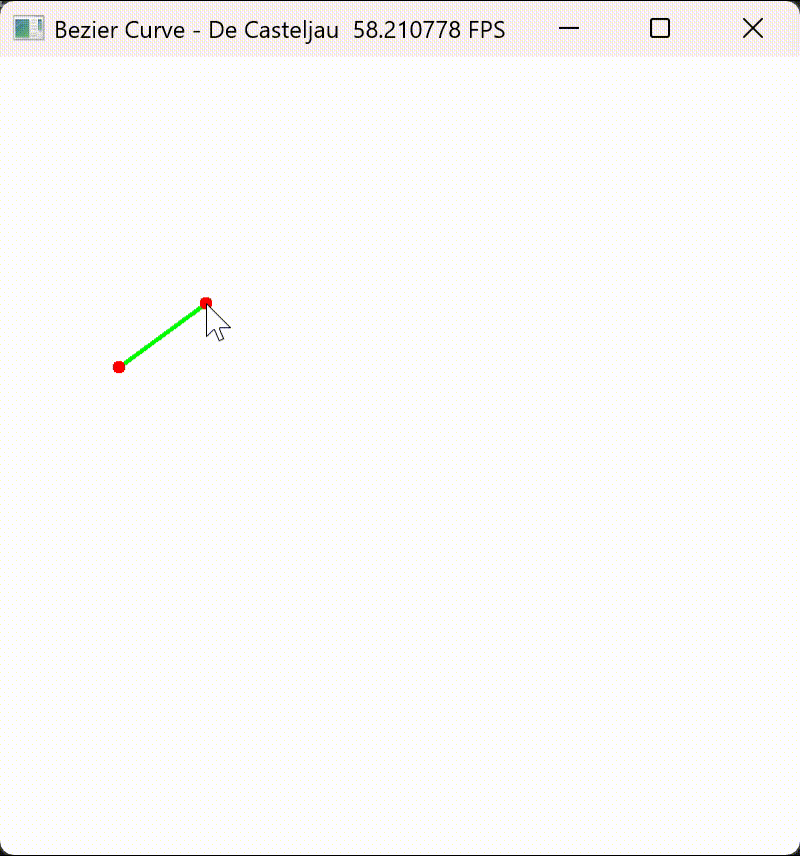
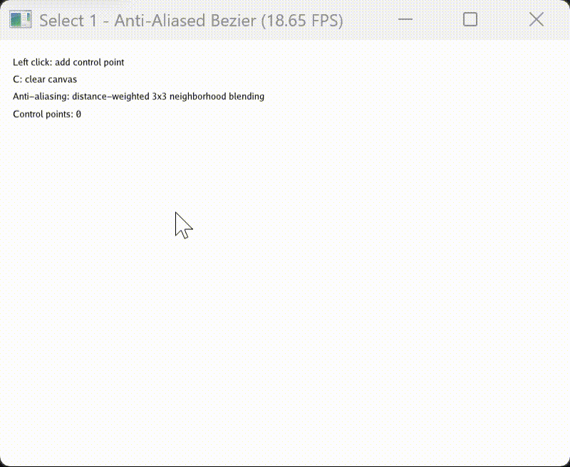
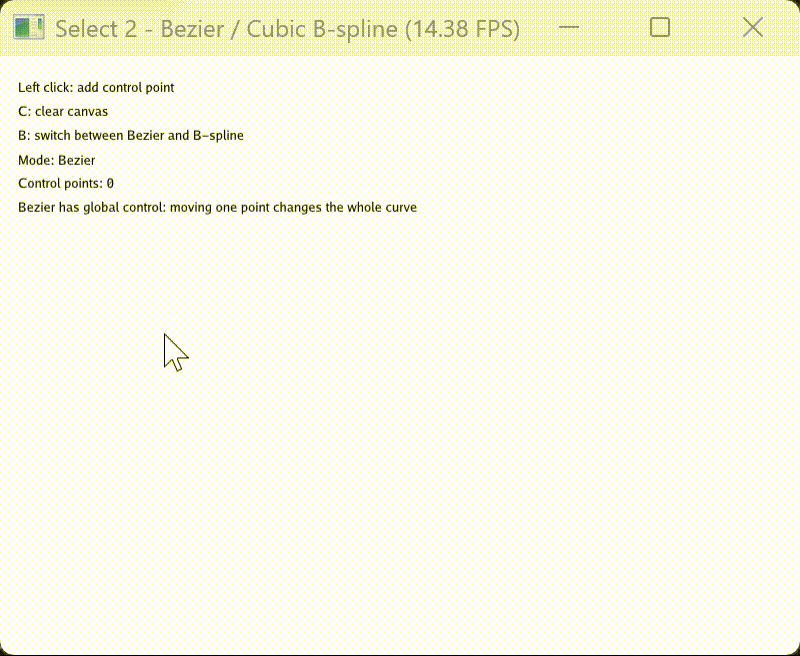

# 实验三：基于Taichi实现的贝塞尔曲线交互式绘制

202411180014-刘奕可-计科

项目完成了基础贝塞尔曲线绘制，并进一步实现了两个选做内容：反走样绘制与B样条曲线模式切换。整体采用Python+Taichi开发，利用GPU字段和图形界面完成实时交互与渲染。

---

## 1. 项目结构


```text
taichi-bezier-lab/
├── assets/
│   ├── demo_main.gif
│   ├── demo_select1.gif
│   └── demo_select2.gif
├── src/
│   └── work0/
│       ├── __init__.py
│       ├── main.py
│       ├── select1.py
│       └── select2.py
├── main.py
├── pyproject.toml
├── uv.lock
└── README.md
````

其中：
* `src/work0/main.py`：基础内容，完成贝塞尔曲线交互式绘制
* `src/work0/select1.py`：选做题1，贝塞尔曲线反走样
* `src/work0/select2.py`：选做题2，贝塞尔曲线与三次B样条曲线切换
* `assets/`：实验演示动图
* 根目录 `main.py`：项目入口占位文件
* `pyproject.toml`：项目依赖与基础配置文件
```

---

## 2. 运行方式


### 运行基础部分

```bash
uv run -m src.work0.main
```

### 运行选做题1：反走样贝塞尔曲线

```bash
uv run -m src.work0.select1
```

### 运行选做题2：B样条曲线

```bash
uv run -m src.work0.select2
```

---

## 3. 实现功能


### 3.1 基础内容：贝塞尔曲线绘制

基础程序位于 `src/work0/main.py`，实现了以下功能：
* 鼠标左键添加控制点
* 实时显示红色控制点
* 使用灰色折线显示控制多边形
* 使用绿色曲线显示贝塞尔曲线
* 按 `C` 键清空画布
该部分采用CPU端De Casteljau算法对曲线进行采样，再将采样点传入GPU字段中进行绘制。控制多边形与曲线均通过像素方式实时更新，因此可以直观观察控制点变化对曲线形状的影响。

### 3.2 选做题1：反走样

选做题 1 位于 `src/work0/select1.py`。
在基础像素化绘制中，曲线采样点在映射到整数像素坐标后容易出现明显的锯齿边缘。为改善这一现象，本程序在曲线绘制时引入了局部像素混合策略：
* 保留曲线采样点的浮点坐标精度
* 对每个采样点考察其周围 `3×3` 像素邻域
* 根据像素中心与真实浮点坐标之间的距离计算权重
* 对邻域像素进行距离衰减混合，使靠近曲线的位置颜色更深，较远位置颜色更浅
这样能够在视觉上减轻阶梯状边缘，使贝塞尔曲线更加平滑。

### 3.3 选做题2：B样条曲线

选做题 2 位于 `src/work0/select2.py`。
该部分在原有交互逻辑基础上新增了两种模式切换：
* 贝塞尔曲线模式
* 三次B样条曲线模式
程序支持按 `B` 键在两种模式之间切换，并保留以下基础交互：
* 鼠标左键添加控制点
* `C` 键清空控制点
* 灰色控制多边形实时显示
* 绿色曲线实时更新
B样条部分采用三次B样条实现方式，并利用Cox-de Boor递归公式计算基函数。程序构造开放均匀结点向量，再在参数区间内进行采样，从而生成平滑曲线。
通过该实验可以直观看到两类曲线的差异：
* 贝塞尔曲线具有全局控制特性，移动一个控制点会影响整条曲线
* B 样条曲线具有局部控制特性，移动一个控制点通常只影响局部曲线形状
这与实验题目中要求观察和验证的现象一致。

---

## 4. 代码逻辑说明


### 4.1 `src/work0/main.py`

基础程序主要由以下几部分组成：

#### 1）数据字段定义

程序中定义了三个重要字段：
* `pixels`：存储整张画布的像素颜色
* `curve_points_field`：存储贝塞尔曲线采样点
* `gui_points`：存储控制点，用于界面绘制

#### 2）核心绘制流程

每一帧主要执行如下步骤：
1. 读取鼠标和键盘输入
2. 更新控制点列表
3. 清空像素缓冲区
4. 根据控制点生成控制多边形
5. 使用De Casteljau算法采样贝塞尔曲线
6. 将曲线采样点绘制到画布上
7. 叠加显示控制点并刷新窗口

#### 3）曲线生成方法

贝塞尔曲线通过 `de_casteljau()` 函数递归插值生成。
程序在CPU端先离散得到 `NUM_SEGMENTS + 1` 个采样点，再交给GPU字段进行显示。

---

### 4.2 `src/work0/select1.py`

该文件在基础内容上主要增加了反走样处理。
主要逻辑为：
* 控制点更新后，重新构造曲线采样点
* 对每个曲线采样点保留浮点坐标
* 在 GPU 内核中遍历该点周围邻域像素
* 根据像素中心到真实曲线点的距离计算混合权重
* 对像素颜色进行插值混合
这种做法比直接将曲线点截断到整数像素更平滑，更符合题目中对抗锯齿效果的要求。

---

### 4.3 `src/work0/select2.py`

该文件在基础交互上增加了曲线模式切换逻辑。
主要包含三部分：

#### 1）贝塞尔曲线计算

延续基础部分思路，使用De Casteljau算法进行参数采样。

#### 2）结点向量构造

通过 `build_open_uniform_knot_vector()` 构造开放均匀结点向量，为三次B样条计算提供参数基础。

#### 3）B 样条基函数计算

通过 `cox_de_boor()` 递归函数计算 B 样条基函数，再通过控制点加权求和得到曲线点。
最终，程序根据当前模式选择生成贝塞尔曲线或B样条曲线，并以统一方式绘制到界面中。

---

## 5. 交互说明


三个程序均支持基本交互操作。

### 基础程序 `main.py`

* 鼠标左键：添加控制点
* `C` 键：清空画布

### 选做题1 `select1.py`

* 鼠标左键：添加控制点
* `C` 键：清空画布

### 选做题2 `select2.py`

* 鼠标左键：添加控制点
* `C` 键：清空画布
* `B` 键：在贝塞尔曲线模式与三次B样条曲线模式之间切换

---

## 6. 运行效果展示


### 基础内容演示



### 选做题1演示：反走样



### 选做题2演示：B样条曲线



---

## 7. 实验总结


本项目基于Taichi实现了贝塞尔曲线的交互式绘制，并在基础要求之上完成了两个拓展方向。
基础部分完成了控制点交互、控制多边形显示与贝塞尔曲线生成。选做题1通过局部像素邻域加权混合，实现了曲线反走样绘制，使曲线边缘更加平滑。选做题2在保留原有交互逻辑的基础上，增加了三次B样条曲线的生成与模式切换，能够直观对比贝塞尔曲线的全局控制特性与B样条曲线的局部控制特性。
整个项目结构清晰，模块划分明确，较好完成了实验中关于算法实现、图形交互和现象观察的要求。